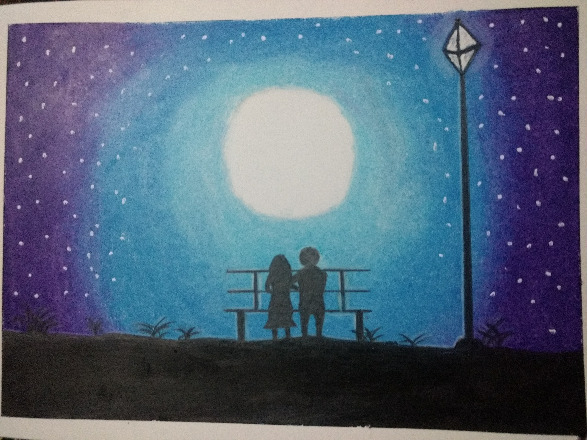
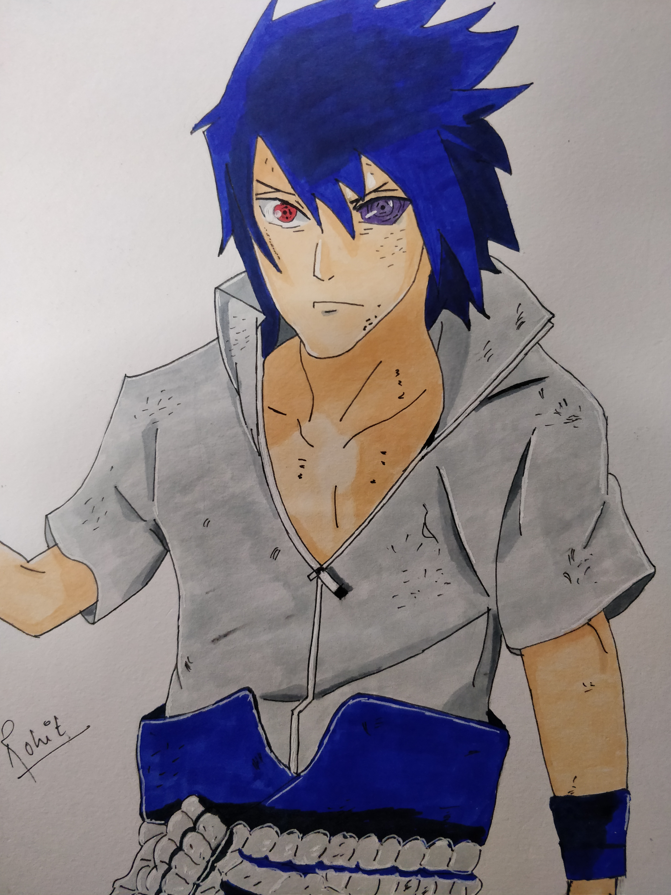

+++
title = "Academic: the website designer for Hugo"
subtitle = "Create a beautifully simple website in under 10 minutes :rocket:"

date = 2016-04-20T00:00:00
lastmod = 2018-01-13T00:00:00
draft = false

# Authors. Comma separated list, e.g. `["Bob Smith", "David Jones"]`.
authors = []

tags = ["Academic"]
summary = "Create a beautifully simple website or blog in under 10 minutes."

# Featured image
# To use, add an image named `featured.jpg/png` to your project's folder. 
[image]
  # Caption (optional)
  caption = "Image credit: [**Unsplash**](https://unsplash.com/photos/CpkOjOcXdUY)"

  # Focal point (optional)
  # Options: Smart, Center, TopLeft, Top, TopRight, Left, Right, BottomLeft, Bottom, BottomRight
  focal_point = ""

[[gallery_item]]
album = "1"
image = "https://raw.githubusercontent.com/gcushen/hugo-academic/master/images/theme-default.png"
caption = "Default"

[[gallery_item]]
album = "1"
image = "https://raw.githubusercontent.com/gcushen/hugo-academic/master/images/theme-ocean.png"
caption = "Ocean"

[[gallery_item]]
album = "1"
image = "https://raw.githubusercontent.com/gcushen/hugo-academic/master/images/theme-forest.png"
caption = "Forest"

[[gallery_item]]
album = "1"
image = "https://raw.githubusercontent.com/gcushen/hugo-academic/master/images/theme-dark.png"
caption = "Dark"

[[gallery_item]]
album = "1"
image = "https://raw.githubusercontent.com/gcushen/hugo-academic/master/images/theme-apogee.png"
caption = "Apogee"

[[gallery_item]]
album = "1"
image = "https://raw.githubusercontent.com/gcushen/hugo-academic/master/images/theme-1950s.png"
caption = "1950s"

[[gallery_item]]
album = "1"
image = "https://raw.githubusercontent.com/gcushen/hugo-academic/master/images/theme-coffee-playfair.png"
caption = "Coffee theme with Playfair font"

[[gallery_item]]
album = "1"
image = "https://raw.githubusercontent.com/gcushen/hugo-academic/master/images/theme-cupcake.png"
caption = "Cupcake"
+++

**Academic** makes it easy to create a beautiful website for free using Markdown. Customize anything on your site with widgets, themes, and language packs.

[]
[]
[]
[]

## License

Copyright 2016-present [George Cushen](https://georgecushen.com).

Released under the [MIT](https://github.com/gcushen/hugo-academic/blob/master/LICENSE.md) license.
