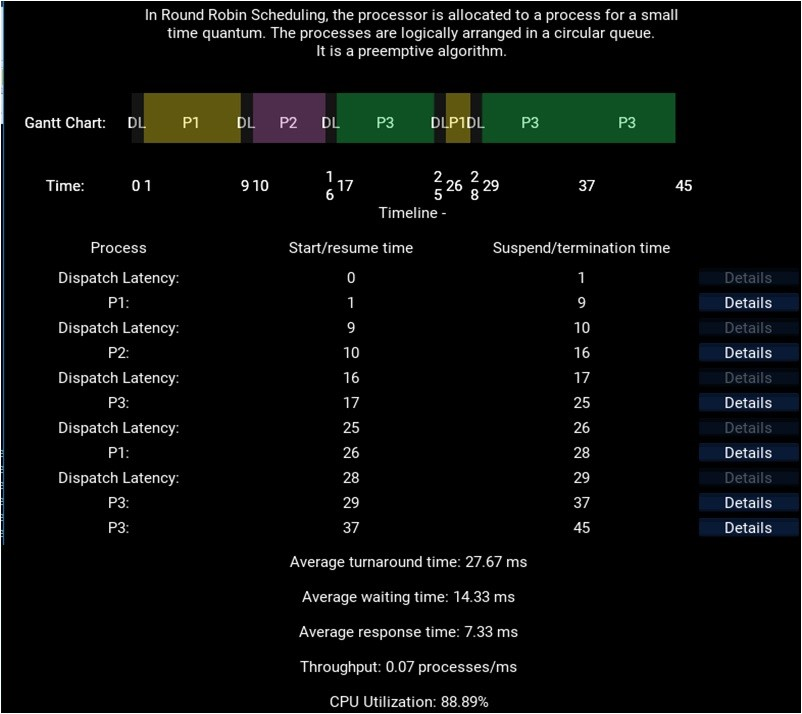
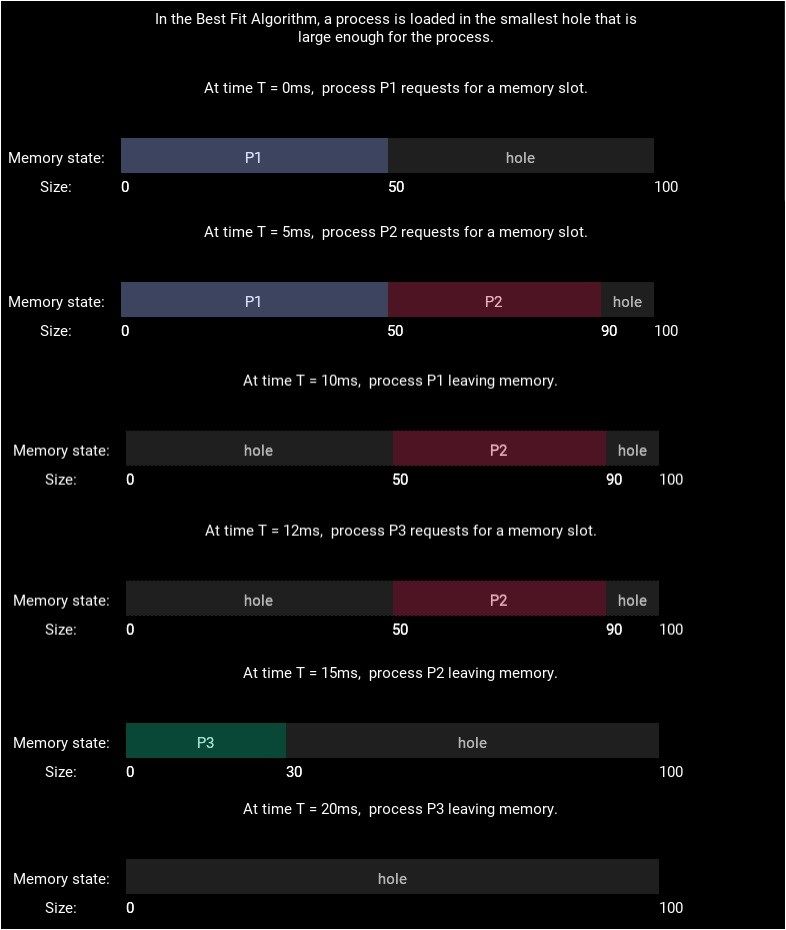
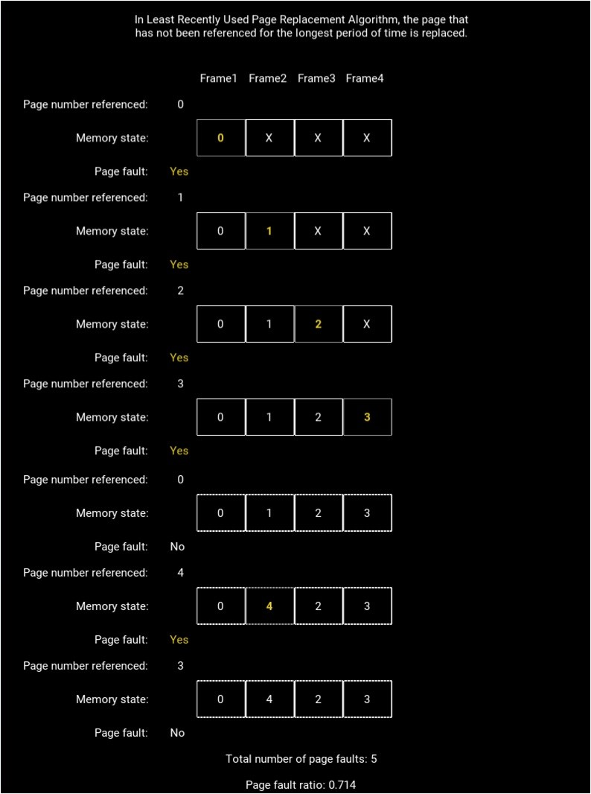
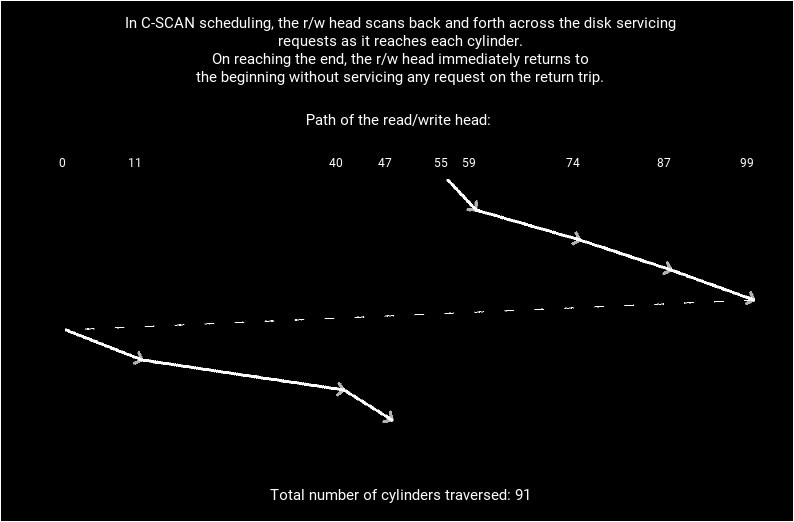

+++
# Project title.
title = "An application to visualize algorithms used in operating systems"

# Date this page was created.
date = 2018-04-27T00:00:00

# Project summary to display on homepage.
summary = "An application to visualize algorithms used in operating systems."

# Tags: can be used for filtering projects.
# Example: `tags = ["machine-learning", "deep-learning"]`
tags = ["Operating Systems", "Android", "Visualization"]

# Optional external URL for project (replaces project detail page).
external_link = ""

# Featured image
# To use, add an image named `featured.jpg/png` to your project's folder. 
[image]
  # Caption (optional)
  caption = "Menu Page"
  
  # Focal point (optional)
  # Options: Smart, Center, TopLeft, Top, TopRight, Left, Right, BottomLeft, Bottom, BottomRight
  focal_point = "Smart"
+++

**OSAVA** visualizes the different types of algorithms used in operating systems as given in Silberschatz et al. (2012). **OSAVA** has six modules each dedicated to a particular type of algorithm. A module asks the user to select one of the algorithms available in it and enter relevant information. The module displays a brief description of the selected algorithm and then simulates its working. Output is provided typically as a combination of text and illustrations. **OSAVA** can visualize a total of twenty-four algorithms (See the table given below).

| Module | Algorithms visualized | Illustration | Output | Pedagogical utility |
|--------|-----------------------|--------------|--------|---------------------|
| CPU scheduling algorithms |	First-come first-served, shortest job first, priority, round robin, multilevel queue and multilevel feedback queue scheduling algorithms | Gantt chart | Turnaround time, waiting time, response time, throughput and CPU utilization | Can be used to solve numerical questions involving large number of processes |
| Deadlock avoidance algorithm |	Banker’s algorithm	| —	 | Safe sequence	 | Can be used to solve numerical questions involving large number of processes and resource types |
| Deadlock detection algorithm	| Variant of Banker’s algorithm |	—	 | List of deadlocked processes | Can be used to solve numerical questions involving large number of processes and resource types |
| Contiguous memory allocation strategies	| First fit, best fit and worst fit strategies | 	Memory map | 	—	 | Can be used to solve numerical questions involving large number of processes |
| Page replacement algorithms	| First-in first-out, optimal, least recently used, second chance, enhanced second chance, least frequently used and most frequently used page replacement algorithms |	Memory map |	Number of page faults and page fault ratio |	Can be used to solve numerical questions involving large number of page faults and frames |
| Disk scheduling algorithms |	First-come first-served, shortest seek time first, SCAN, C-SCAN, LOOK and C-LOOK disk scheduling algorithms	Trace of the path followed by read/write head	| Number of cylinders traversed by read/write head	| Can be used to solve numerical questions involving large number of disk accesses |

### CPU scheduling algorithms
A computer using a multitasking operating system has multiple processes loaded in its memory at a given time. The operating system uses a CPU scheduling algorithm to decide which of those processes will be executed next. **OSAVA** can visualize the CPU scheduling algorithms commonly used by operating systems. The user has to enter the arrival time and the CPU burst time of the processes. The user then needs to select the CPU scheduling algorithm to be visualized. When shortest job first and priority scheduling algorithms are selected, the user needs to specify whether non-preemptive or preemptive scheduling is to be performed. If priority scheduling is used, then the user also needs to enter the priority of each process. In case of priority scheduling, **OSAVA** can also visualize the concept of aging in which the priority of a process is incremented every time it waits in the ready queue for a predefined amount of time. If round robin scheduling is used, then the user needs to specify the time quantum. When multilevel queue scheduling and multilevel feedback queue scheduling are selected, then first-come first served and round robin algorithms are used for intra-queue scheduling and preemptive priority scheduling algorithm is used for inter-queue scheduling. Details of the queues are to be entered by the user. Finally, the user has to enter the dispatch latency which is considered to be negligible if the user chooses not to enter a value. **OSAVA** simulates the selected CPU scheduling algorithm and displays a Gantt chart showing the time intervals when the different processes executed on the CPU. **OSAVA** then displays a timeline representing the execution of the processes. The turnaround time, waiting time and response time of a particular process can be viewed by tapping on the ‘Details’ button next to it. To calculate the response time of a process, it is assumed that a process generates its first response to the user as soon as it starts executing. The average turnaround time, the average waiting time and the average response time of the processes are then calculated. The throughput of the system and the CPU utilization are also displayed (Fig. 1). **OSAVA** displays more information about the processes than the earlier tools (Khuri and Hsu 1999; Suranauwarat 2007; Fischbach 2013) but in a more compact format.

### Deadlock handling algorithms
In context of operating systems, a deadlock is a situation where two or more processes are waiting indefinitely because the resources they have requested for are being held by one another. Operating systems may use three techniques to handle deadlocks, viz. deadlock prevention, deadlock avoidance, and deadlock detection and recovery. The Banker’s algorithm is a well known deadlock avoidance technique and can be visualized by **OSAVA**. The user has to enter the number of resources of different types that have been allocated to the processes and the maximum number of resources of each type that the processes can request for. The user also needs to enter the number of resources of each type that are currently free. Finally, the user needs to specify a process that is now requesting for more resources and enter the number of resources of each type the process is requesting for. It is assumed that the system is initially in a safe state, i.e. there is no possibility of a deadlock. **OSAVA** uses the resource-request algorithm to determine the state in which the system will be in if the requested resources are granted to the process. Then **OSAVA** uses the safety algorithm to find a safe sequence, i.e. a sequence in which the processes should be executed so that they can be allocated the resources they need. The matrices and vectors involved in the calculation are displayed to enhance pedagogy.
Instead of using the deadlock avoidance algorithm, operating systems may choose to detect deadlocks as they occur and recover from them. The algorithm to detect deadlocks is similar to the Banker’s algorithm and can be visualized by **OSAVA** as well. The user has to enter the number of resources of different types that have been allocated to the processes and the number of resources of each type that are currently free. The user then needs to enter the number of resources of each type that the processes are now requesting for. **OSAVA** tries to find a sequence in which the processes can be allocated the resources they are requesting for without causing a deadlock. If such a sequence cannot be found, then **OSAVA** lists the deadlocked processes.

### Memory management algorithms
An operating system may use a contiguous memory allocation scheme wherein a process is loaded in a contiguous block of memory. **OSAVA** can visualize three common contiguous memory allocation strategies, viz. first fit, best fit and worst fit. The user has to enter the size of the memory, and arrival time, turnaround time and memory requirement of each process. **OSAVA** then visualizes a memory allocation strategy and displays a map of the memory whenever a process arrives or terminates. Such a memory map shows which parts of the memory are occupied by the different processes and which parts are free (Fig. 2).

Most operating systems use pure demand paging to implement virtual memory. Such operating systems must use a page replacement algorithm to select a page to be swapped out from the memory in case of a page fault. The commonly used page replacement algorithms can be visualized by **OSAVA**. The user has to enter the number of frames in the memory that have been allocated to a process and a reference string. **OSAVA** then visualizes the selected page replacement algorithm. It shows which page is residing in which frame after each memory access. **OSAVA** also calculates the total number of page faults and the page fault ratio (Fig. 3). The user interface of **OSAVA** is simpler and more intuitive to use than those of the earlier tools (Khuri and Hsu 1999; Fischbach 2013; Garmpis 2013) for visualizing page replacement algorithms.

### Disk scheduling algorithms
A hard disk is used as the secondary storage device of a typical computer. Operating systems use an algorithm to schedule the requests to access the different cylinders in the disk in order to decrease the average access time. The common disk scheduling algorithms can be visualized by **OSAVA**. The user has to enter the number of cylinders in the disk, the current position and the direction of movement of the read/write head. **OSAVA** simulates a disk scheduling algorithm, and displays a trace of the path followed by the read/write head and the count of cylinders traversed (Fig. 4).

### Implementation
**OSAVA** has been implemented in Python. It can be downloaded from the Google Play online app store (https://play.google.com/store/apps/details?id=org.nsit.OSAVA&hl=en) and installed on all mobile phones that use the Android operating system. **OSAVA** is free and open-source (https://github.com/OSAVA-nsit/OSAVA), and does not require connecting to the Internet.

### Contribution
I implemented the CPU scheduling algorithms. Other contributors include:

 * Udit Arora (https://github.com/uditarora)
 * Namrata Mukhija (https://github.com/Namrata96)
 * Priyanka Singla (https://github.com/priyankasingla)

### Acknowledgement
I would like to thank Prof. Pinaki Chakraborty (http://nsit.ac.in/faculty/pnc/) for the ideas and discussions during the development of **OSAVA**.